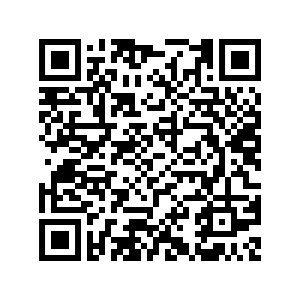

<br>
[](https://github.com/AzizBgBoss/TerrariaDS/releases)
# TerrariaDS
A terraria remake (not port) for the Nintendo DS made by AzizBgBoss, started on the 26th of July 2025.<br>

I'm a 17 y/o that's obsessed with programming, I'm also into Terraria! I love the freedom you get in the game and the endless possibilities it has to offer. Another thing I love is the Nintendo DS, it's a great console and I wondered if I can fuse the 3 thing I love together, so I programmed Terraria into the DS! TerrariaDS!<br>
<br>
This project is a work in progress and is not affiliated with the original Terraria game. It aims to replicate the core mechanics and gameplay of Terraria on the Nintendo DS.
It aims at least to somewhat replicate the 3DS version of Terraria, but with some features from the PC version, and some sacrifices to fit the DS hardware limitations.<br>
<br>
I'm trying as hard as possible to stay loyal to the original game design, but there are some limitations due to the DS hardware and the fact that this is a remake, not a port.<br>
Also please note: ***For now***, I'm prioritizing functionality over content. I'm trying to perfect the core mechanics of the game before adding the Terraria content (Items, tiles, structures...), because without functionality, you wouldn't truly enjoy the content.<br>
<br>
I'm very open to contributions and suggestions, so if you want to help, feel free to open a pull request or an issue.<br>
<br>
If you want to try the latest changes, you can compile the project yourself, or wait for a new release to be published.<br>
<br>
You can join my [Discord server](https://discord.gg/zfMwPhvDc4) for more updates and discussions.<br>

### Disclaimer
This project is not affiliated with Re-Logic or Terraria in any way. It is a fan-made project and is not intended for commercial use. All assets used in this project are use for educational and entertainment purposes only. If you're a party of Re-Logic and owner of any assets used in this project and want them removed, please contact me.

### Notes:
- Almost a 1000 downloads, I never expected it to be this good. Thank you very much for trying my game and I hope you'll enjoy the next updates.
- This project has huge potential, but I'm having trouble concentrating and keeping attention when working on it. Of course, I'm still going to work on it, but on a slower pace. You can contribute if you want.
- I also freaking broke my DSi, ~~and my broke ass doesn't have money for a new system yet (thinking about a 3DS). Expect development to slow down.~~ I finally bought a 3DS! This will hopefully help.

## Installation:
You can either compile the game yourself (for nightly releases) or check for stable releases in the Releases page. Please check the Tested devices part before starting.

### Tested devices:
| System                           | Functionality             | Cons                  | Notes                                                                                                       |
|----------------------------------|---------------------------|-----------------------|-------------------------------------------------------------------------------------------------------------|
| Nintendo DSi (XL) (TM++)         | Excellent                 | None                  | Make sure to set launcher as Default                                                                 |
| Nintendo 3DS (New) (XL) (TM++)   | Excellent                 | None                  | Should work fine as long as you're using TW++ since it basically becomes a DSi at that point. Also you can just play Terraria 3DS lol.|
| Flashcarts (DS/DS Lite/DSi)      | Not tested yet            | Not tested yet        | You should probably patch the .nds rom with the proper DLDI patch depending on your flashcart type (e.g., R4) |
| NO$GBA (Windows Emulator)        | Medium                    | No ability to save + Choppy sound | The emulator doesn't have DLDI support.                                         |
| desMuMe (Windows Emulator)       | Non-functional            | Game doesn't even start |                                                                             |
| melonDS (Windows Emulator)       | Non-functional            | No nitroFS              | The emulator *has* DLDI support but it doesn't work with this game, maybe they'll fix it in a future update. But for some reason NitroFS won't work with melonDS. |
| melonDS (Special fork)           | Excellent                 | None                  | This is a fork of the original melonDS with NitroFS and FAT support added. You can find it [here](https://github.com/AzizBgBoss/TerrariaDS/raw/refs/heads/main/extras/melonDS.exe). I got it somewhere from the DS(i) Mode Customization! Discord server, don't worry it shouldn't contain any malware. But as soon as I find the original link, I'll put it here. | 
*More platforms will be tested soon.*

## Download the latest version (QR code scannable with DSi Downloader)



## Gameplay:
- A: Jump
- Left/Right: Move
- Up/Down: Zoom in/out
- X/Y: Switch items
- R: Open inventory
- Start: Pause menu
- A+B+Y+X: Debug menu

## Changelog and Features
Don't get your hopes really up, but with time, I'm sure the game will feel much more like terraria.

### Version 0.0alpha ([](https://github.com/AzizBgBoss/TerrariaDS/releases/tag/0.0alpha)):
Initial commit with basic project structure.
- Basic tile rendering and scrolling. ***(done)***
- Touch input handling for world interaction and inventory interaction. ***(done)***
- Map generation (terrain, caves, trees and mushrooms). ***(done)***
- Map saving and loading functionality. ***(done. you can use START to save, and SELECT to load for now)***
- Camera zooming. ***(done)***
- Basic crafting system. ***(done)***
- Add music. ***(done)***

### Version 0.1 ([](https://github.com/AzizBgBoss/TerrariaDS/releases/tag/0.1)):
- Ability to save/load different maps. ***(done: you can only see 10 maps for now)***
- Add special tiles (tiles that need interaction and are not 1:1, like doors, crafting benches, chests...) ***(done for now: Doors)***
- Add health. ***(done)***
- Add menus. ***(done for now: Pause menu, debug menu (they don't look the best but do the job for now))***
- Add entities (NPCs, enemies, etc.) to the game world. ***(done for now: Green Slimes)***
- Add attacking and damage mechanics for other entities like the stinky winky green slime. ***(done for now: Player can damage an entity thats directly touched with a weapon)***
- Add ores. ***(done for now: Copper, Tin)***
- Fix some screen jittering issues. ***(done: you shouldn't read nitro files in the loop every frame, it makes the scroll changement miss VBlank)***
- Fix sprites being offset from their world coordinates. ***(yeah I don't even know how I made a mess that kinda works and now I don't understand it anymore if you can please help me with it)***
- Add simple day/night cycle (just darken the rear background and start spawning enemies at night). ***(done)***
- Add sound effects. ***(done)***

### Version 0.2 (Plans):
- Probably add a bit more enemies.
- Ability to save character data and world data independently.
- Remember that jittering? I didn't get rid of it completely: When sprites are animated, each new frame is loaded from NitroFS. I need to load all the frames of existing entities to RAM directly so reading from NitroFS won't slow it down.
- Probably converting all tile handling data to a struct.
- Organize my messy code and split it to many files, won't change anything but will make it easier to add features.
- Support for maps with more height (limit is 64 for now, that means chunking should happen in both X and Y axes).
- Add swinging animation.
- Add crimson/corruption.
- Add ability to change button mappings (since many DS'es (including mine) have malfunctioning shoulder buttons because of dust accumulation under them over the years).
- Add improved lighting.
- Add more biomes (desert, jungle, etc.).

## Planed Features for the future:
- Multiplayer support.
- Skins (or changeable player styles).
- Add mana and magic items.
- Add bosses.
- Unique content for the DS version to make it stand out a bit.
- Extra content and features for the DSi.

Again, I'm open to suggestions and contributions, so if you have any ideas or want to help, feel free to open a pull request or an issue.

## Compile it yourself
To compile this project, you need to have devkitPro installed. You can find instructions on how to install it on the [devkitPro website](https://devkitpro.org/wiki/Getting_Started) (Note: devkitPro NDS compilation only works on Windows as far as I know, or x86_64 architectures in general), I also always hear about some BlocksDS, I think that causes errors.

Once you have devkitPro installed, you can clone this repository by running:
```bash
git clone https://github.com/AzizBgBoss/TerrariaDS.git
```

Then, navigate to the project directory:
```bash
cd TerrariaDS
```

For good measure, clean the place first:
```bash
make clean
```

Now, you can compile the project by running:
```bash
make
```
This will create a `TerrariaDS.nds` file in the root directory of the project.

(Note: if you're not using the Msys2 shell, you may need to define the `DEVKITPRO` environment variable to point to your devkitPro installation directory, e.g. `export DEVKITPRO=/mnt/c/devkitPro` and `export DEVKITARM=/mnt/c/devkitPro/devkitARM`)

## Credits
- AzizBgBoss for the DS remake.
- DS(i) Mode Customization! Discord server for being very helpful and provide me with resources to understand how the DS works.
- The Terraria Wiki for being the best source to understand how blocks and all Terraria mechanics work.
- Re-Logic for making such a great game.
- Shoutout to the Testers: Me (DSi), Vinii (New 3DS XL). 

## Donate:
This game is totally free and if you enjoy this project and would like to support its development, any donation, no matter how small, would be greatly appreciated. I'm a teenager and I really don't have much time with school and other stuff, so your generosity helps motivate me and dedicate more time to continue working on TerrariaDS and bring new features to life. Thank you for considering a contribution!
- USDT (TRX20): TVq9gPQP2xTybbA2QtWrXBuQgvxZSVdiXm
- USDT (ETH): 0x63FCB723F9EaA3100b466f229067227EfA461Bf7

## Screenshots
.png)
.png)
.png)
.png)
.png)
.png)